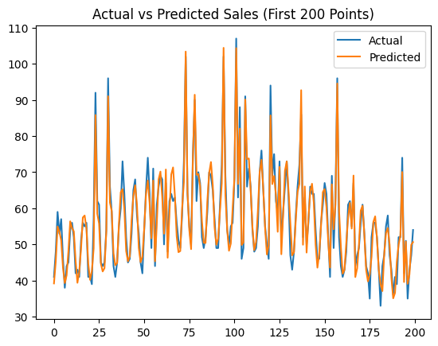
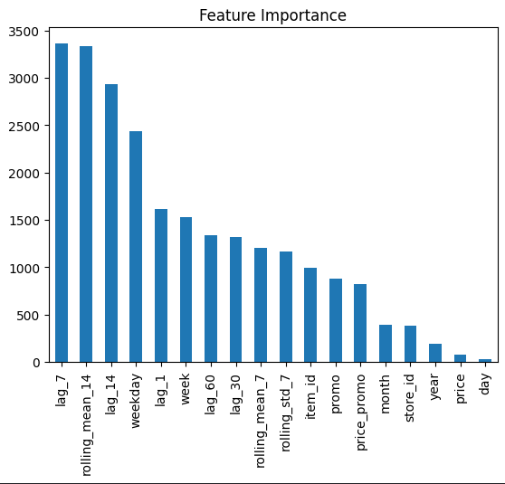
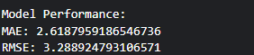
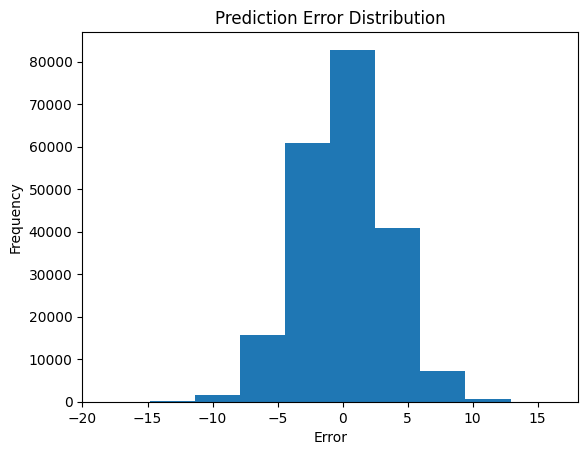

# Retail Demand Forecasting with LightGBM

## Project Overview
This repository contains a high-performance predictive pipeline for retail demand forecasting. The model uses a **LightGBM Regressor** to analyze over **1 million records** and predict daily sales across multiple stores and items.

The core strength of this project lies in **feature engineering**, particularly the use of **time-series lag variables** to capture seasonal patterns and recent consumer behavior.

---

## Dataset Highlights

The model was trained on a comprehensive retail dataset with the following characteristics:

- **Volume:** 1,048,575 rows  
- **Features:**
  - `date`
  - `store_id`
  - `item_id`
  - `price`
  - `promo`
- **Target Variable:** `sales` (daily sales volume)  
- **Granularity:**
  - 12 unique stores  
  - 50 unique items  

---

## Technical Workflow

### 1. Feature Engineering

To transform raw retail data into a time-series forecasting problem, the following features were engineered:

- **Temporal Features:**
  - Extracted `day`, `week`, and `year` from the date  

- **Lag Features:**
  - `lag_1`: Previous day's sales  
  - `lag_7`: Sales from the same day in the previous week  
  - `lag_30`: Sales from the previous month  

These features enable the model to learn both short-term and seasonal trends.

---

### 2. Modeling Strategy

- **Algorithm:** LightGBM (Gradient Boosting Machine)  
- **Validation Strategy:** Time-based split to ensure generalization on future data  
- **Optimization:**
  - Categorical features (`store_id`, `item_id`) handled via:
    - Label encoding  
    - or native LightGBM categorical support  

---

## Performance Metrics

The model achieved the following performance:

- **MAE (Mean Absolute Error):** 2.62  
- **RMSE (Root Mean Squared Error):** 3.29  
- **SMAPE (Symmetric Mean Absolute Percentage Error):** 10.27%  

---

## Model Results

### 1. Actual vs Predicted Sales

  

This graph compares actual sales values with predicted values, showing that the model effectively captures demand patterns.

---

### 2. Feature Importance

  

This plot highlights the most influential features used by the model, with lag and temporal features contributing significantly to predictions.

---

### 3. Model Performance

  

  

These plots provide additional evaluation perspectives, confirming the model’s consistency and reliability.

---

### 4. Prediction Error Detection (PED)

  

The Prediction Error Detection (PED) graph visualizes the distribution of errors, helping identify where the model deviates from actual values.

---

## Result Interpretation

The model demonstrates strong predictive performance with low error values across all evaluation metrics. The relatively low SMAPE indicates consistent accuracy across varying sales volumes, making the model suitable for real-world retail demand forecasting and inventory planning applications.
